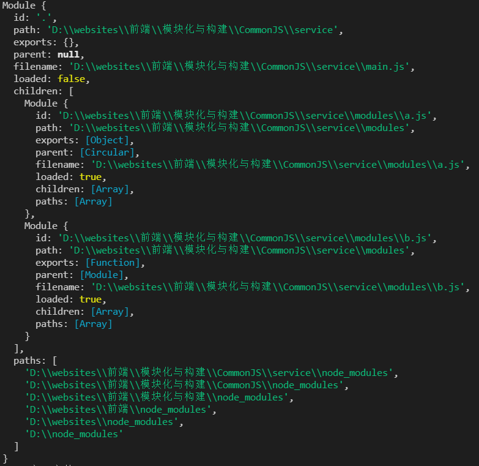

## 前端模块化

### 模块的概念
> 模块就是完成特定功能的单元。
模块具有以下几个基本属性：功能、接口、状态、逻辑。功能、接口与状态反映模块的外部特性，逻辑反映它的内部特性。在开发场景中，一个模块就是实现特定功能的文件。

### 前端模块化的历程
- 一开始js并没有模块化的概念
  - 当页面越来越复杂，代码越来越大，维护越来越不方便。
  - 将js代码抽取为独立的js文件，就会遇到问题：
    - 全局变量污染
    - 函数名冲突
    - 代码依赖关系不好处理，比如有依赖关系的js必须按顺序加载，加载完后才能依赖前一个js文件内的变量或函数。
  - 自执行函数(`IIFE: Immediately Invoked Function Expression`)，能够解决变量污染和冲突的问题(JQuery的做法)：
    ```js
    (function () {
      // statements
      var x = 1  
      return { a: x };
    })();
  - js的依赖关系仍然没有解决：js文件的加载靠的是浏览器的加载能力，默认是阻塞式的加载，`async`异步加载顺序没有保证，`defer`异步加载虽然可以保证加载顺序，但依赖的维护仍靠手动，不灵活。

### 模块化的解决方案

#### 模块化的两个关键概念：
  - **导出**： 模块对外暴露的信息，可以导出变量，常量，函数，对象等，使用`export`关键字，通过`export`导出的变量、常量、函数和对象，在其他的js文件中可以使用，否则，其他的js文件时不能使用的。即模块内的变量、常量、函数都是只能内部使用。
  - **导入**：导入就是在当前js文件中引入其他的js文件，并能使用其他js通过`export`导出的变量、常量、函数等，使用`require`或`import`关键字进行导入

#### 模块化规范
  最先流行的是`AMD`、`CMD`规范，主要的实现是`require.js`和`Sea.js`
  > `AMD`和`CMD`只是一种设计规范，而不是一种实现。
#### `AMD`（`Asynchronous Module Definition`即`异步模块定义`）
  - **define**
    `define`方法用于定义一个模块，它接收两个参数：
      - 第一个参数是一个数组，表示这个模块所依赖的其他模块
      - 第二个参数是一个方法，这个方法通过入参的方式将所依赖模块的输出依次取出，并在方法内使用，同时将返回值传递给依赖它的其他模块使用。
  - **require**
#### `CMD`
#### `CommonJS`，主流的实现有`nodejs`、`webpack`、`babel`等
  **规范要求**：
  - 一个模块就是一个文件
  - 每个模块内有两个变量可以使用：require 和 module
  - 通过require加载模块
  - 通过module.exports或者exports导出模块（为了方便，Node.js 在实现 CommonJS 规范时，为每个模块 提供一个 exports 的私有变量，指向 module.exports）

  **特点**
  - 在`Nodejs`中模块的加载方式是同步的，因为在服务器端所有的文件都存储在本地的硬盘上，传输速率快且稳定
  - `CommonJS` 模块输出的值，对于基本数据类型，是复制，对于复杂数据类型，是浅拷贝。
  - `CommonJS` 模块输出的是值的缓存，不存在动态更新，当使用require命令加载某个模块时，就会运行整个模块的代码,然后在内存生成一个对象。Require 命令加载同一个模块，不会再执行，而是取缓存之中的值。即，commonjs模块无论加载多少次，都只会在第一次加载的时候运行一次，以后再加载，就返回第一次运行的结果。除非手动清除系统缓存。
  - `Requirejs` 循环加载时候，属于加载时执行。即脚本在require的时候，就会全部执行。一旦出现某个模块被循环加载，就只输出已经执行的部分，还未执行的部分不会输出。
  - `Require` 是动态加载，这意味着require语句可写在任何位置，同时也意味着commonjs模块只能在运行时才能确定模块的依赖关系。

  **核心实现逻辑**
  - 解析模块路径
  - 同步从本地读取模块文件内容，得到文本字符串
  - 将字符串包裹成自执行函数的前半部分
  - 使用`vm`沙箱将字符串转换成函数（vm是node.js的虚拟沙箱模块，vm.runInThisContext方法可以接受一个字符串，并将它转换成一个函数返回）
  - 执行函数（将关键变量传入进去：`exports`、`require`、`module`、`__filename`、`__dirname`）

  ```js
  // require源码

  // id 为路径标识符
  function require(id) {
    /* 查找  Module 上有没有已经加载的 js  对象*/
    const  cachedModule = Module._cache[id]
    
    /* 如果已经加载了那么直接取走缓存的 exports 对象  */
    if(cachedModule){
      return cachedModule.exports
    }
  
    /* 创建当前模块的 module  */
    const module = { exports: {} ,loaded: false , ...}

    /* 将 module 缓存到  Module 的缓存属性中，路径标识符作为 id */  
    Module._cache[id] = module
    /* 加载文件 */
    runInThisContext(wrapper('module.exports = "123"'))(module.exports, require, module, __filename, __dirname)
    /* 加载完成 *//
    module.loaded = true 
    /* 返回值 */
    return module.exports
  }
  ```
  