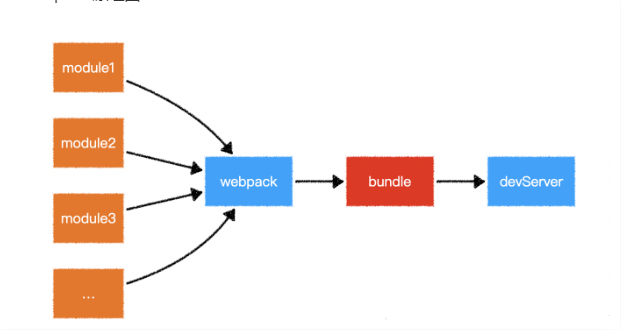
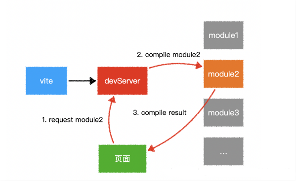

## 前端模块化和构建工具

### 模块的概念
  > 在模块化编程中，开发者将程序分解成离散功能块(discrete chunks of functionality)，并称之为模块。 每个模块具有比完整程序更小的接触面，使得校验、调试、测试轻而易举。 精心编写的模块提供了可靠的抽象和封装界限，使得应用程序中每个模块都具有条理清楚的设计和明确的目的。


- 模块化的好处
  > + 避免命名冲突(减少命名空间污染)
  > + 依赖管理
  > + 更好的分离, 按需加载
  > + 更高复用性
  > + 高可维护性

- AMD
  - requireJs
- CMD
  - seajs
- CommonJS
  > 在服务器端，模块的加载是运行时同步加载的；在浏览器端，模块需要提前编译打包处理。
  - 所有代码都运行在模块作用域，不会污染全局作用域。
  - 模块可以多次加载，但是只会在第一次加载时运行一次，然后运行结果就被缓存了，以后再加载，就直接读取缓存结果。要想让模块再次运行，必须清除缓存。
  - 模块加载的顺序，按照其在代码中出现的顺序，父-> 子 -> 父
  ```js
  // require源码

  // id 为路径标识符
  function require(id) {
    /* 查找  Module 上有没有已经加载的 js  对象*/
    const  cachedModule = Module._cache[id]
    
    /* 如果已经加载了那么直接取走缓存的 exports 对象  */
    if(cachedModule){
      return cachedModule.exports
    }
  
    /* 创建当前模块的 module  */
    const module = { exports: {} ,loaded: false , ...}

    /* 将 module 缓存到  Module 的缓存属性中，路径标识符作为 id */  
    Module._cache[id] = module
    /* 加载文件 */
    runInThisContext(wrapper('module.exports = "123"'))(module.exports, require, module, __filename, __dirname)
    /* 加载完成 *//
    module.loaded = true 
    /* 返回值 */
    return module.exports
  }
  ```

- ES6
  - 使用npm进行包安装
  - 使用babel将es6转成es5
  - 使用browserify编译js


- 什么是模块化
  > 将一个复杂的程序依据一定的规则(规范)封装成几个块(文件), 并进行组合在一起块的内部数据与实现是私有的, 只是向外部暴露一些接口(方法)与外部其它模块通信

- ES6与CommonJS的差异
  > ① CommonJS 模块输出的是一个值的拷贝，ES6 模块输出的是值的引用。
  ② CommonJS 模块是运行时加载，ES6 模块是编译时输出接口。

  > ES6 的模块自动采用严格模式，不管你有没有在模块头部加上"use strict";

- > CommonJS规范主要用于服务端编程，加载模块是同步的，这并不适合在浏览器环境，因为同步意味着阻塞加载，浏览器资源是异步加载的，因此有了AMD CMD解决方案。
ES6 在语言标准的层面上，实现了模块功能，而且实现得相当简单，完全可以取代 CommonJS 和 AMD 规范，成为浏览器和服务器通用的模块解决方案。

### 构建工具
> 源代码无法直接运行，必须通过转换后才可以正常运行。构建主要做以下事情：
- 代码转换:将 TypeScript 编译成JavaScript、将 SCSS 编译成 CSS等
- 文件优化:压缩JavaScript、CSS、HTML 代码，压缩合并图片等。
- 代码分割:提取多个页面的公共代码，提取首屏不需要执行部分代码让其异步记在。
- 模块合并:在采用模块化的项目里会有很多个模块和文件，需要通过构建功能将模块分类合并成一个文件。
- 自动刷新:监听本地源代码变化，自动重新构建、刷新浏览器。
- 代码校验:在代码被提交到仓库前需要校验代码是否符合规范，以及单元测试是否通过。
- 自动发布:更新代码后，自动构建出线上发布代码并传输给发布系统。

### 工具
- Npm Script
- Grunt
  > 每个任务的具体执行代码和依赖的关系写在配置文件Gruntfile.js里。Grunt的缺点是集成度不高，要写很多配置文件后才可以使用，无法做到开箱即用。
- Gulp
  > Gulp是一个基于流的自动化构建工具.
  只通过下面5种方法就可以支持几乎所有的构建场景：
  - 通过gulp.task注册一个任务
  - 通过gulp.run执行任务
  - 通过gulp.watch监听文件变化
  - 通过gulp.src读取文件
  - 通过gulp.dest写文件
- webpack
  > Webpack是一个模块化打包工具，在Webpack里面一切文件皆为模块，通过Loader转换文件，通过Plugin注入钩子，最后输出由多个模块组合成的文件。Webpack专注于构建模块化项目。
  Webpack的有优点是：
  - 专注于处理模块化的项目，能做到开箱即用
  - 通过Plugin拓展，完整好用又不失灵活
  - 使用场景不局限于 Web 开发
  - 社区庞大活跃

- Rollup
  > Rollup是一个和Webpack类似但专注于ES6的模块打包工具。
  能针对ES6源码进行Tree Shaking，以除去那些已经被定义但没被使用的代码并进行Scope Hoisting,以减少输出文件的大小和性能提升
- vite
  > 一个开箱即用的开发服务器 + 打包工具的组合。

### vite 跟webpack对比
#### webpack原理：

> 项目中使用的每个文件都是一个模块，通过相互的引用，模块会形成一个图（`ModuleGraph`）数据结构。打包的过程中，模块会合并成chunk，chunk合并成chunk组，并形成一个通过模块互相连接的图（`ModuleGraph`）

- `chunk`
`chunk`有两种形式：
  - `initial（初始化）`是入口起点的`main chunk`。此`chunk`包含为入口起点指定的所有模块及其依赖项。
  - `non-initial`是可以延迟加载的块。可能会出现使用`动态导入（dynamic imports）`或者`SplitChunksPlugin`时。
每个 chunk 都有对应的 asset(资源)。资源，是指输出文件（即打包结果）。

[揭示内部原理](https://webpack.docschina.org/concepts/under-the-hood/)

- `ouput(输出)`
  
  输出文件的名称会受配置中的两个字段的影响：
  - `output.filename` - 用于 `initial chunk` 文件
  - `output.chunkFilename` - 用于 `non-initial chunk` 文件
  - 在某些情况下，使用 `initial` 和 `non-initial` 的 `chunk` 时，可以使用 `output.filename`。

  > 如果配置中创建出多于一个 `"chunk"`（例如，使用多个入口起点或使用像 `CommonsChunkPlugin`这样的插件），则应该使用 `占位符(substitutions)` 来确保每个文件具有唯一的名称。
  这些字段中会有一些 占位符。常用的占位符如下：

  - [`id`] - chunk id（例如 `[id].js` -> `485.js`）
  - [`name`] - chunk name（例如 `[name].js` -> `app.js`）。如果 `chunk` 没有名称，则会使用其 `id` 作为名称
  - [`contenthash`] - 输出文件内容的 `md4-hash`（例如 `[contenthash].js` -> `4ea6ff1de66c537eb9b2.js`）

- `loader`
  `webpack`只能理解 `javascript` 和 `JSON` 文件，`loader` 让`webpack` 能够去处理其他类型的文件，并将他们转换为有效的模块，以供程序使用，以及被添加到依赖图中。

  在更高层面，在 `webpack` 的配重中，`loader` 有两个属性：
  - 1、`test` 属性，识别出哪些文件会被转换
  - 2、`user` 属性，定义出在进行转换时，应用使用哪个 `loader`
  > 在 `webpack` 配置中定义 `rules` 时，要定义在 `module.rules` 中，而不是在 `rules` 中。
  使用正则表达式匹配文件时，不要添加引号。`/\.txt$/` 与 `'/\.txt$/'` 和 `"/\.txt$/"`不一样。

- `plugin(插件)`
  `loader`用于转换某些类型的模块，而插件则可以用于执行范围更广的任务，包括：打包优化、资源管理、注入环境变量。
  ```js
  const HtmlWebpackPlugin = require('html-webpack-plugin'); // 通过 npm 安装
  const webpack = require('webpack'); // 用于访问内置插件

  module.exports = {
    module: {
      rules: [{ test: /\.txt$/, use: 'raw-loader' }],
    },
    plugins: [new HtmlWebpackPlugin({ template: './src/index.html' })],
  };
  ```
- `mode（模式）`
  通过选择 `development`, `production` 或 `none` 之中的一个，来设置 `mode` 参数，你可以启用 `webpack` 内置在相应环境下的优化。其默认值为 `production`

#### vite原理：


1、从上图我们可以看出来，Webpack Dev Server 在启动时，需要先打包—遍，然后启动开发服务器，这一过程是需要耗费很多时间的。而vite是直接启动Server，并不会先编译所有的代码文件
2、在进行热更新时，Webpack 修改某个文件过后，会自动以这个文件为入口重写 build—次，所有的涉及到的依赖也都会被加载一遍，所以反应速度会慢很多。而Vite 只需要立即编译当前所修改的文件即可，所以 响应速度非常快
3、Webpack 工具的做法是将所有模块提前编译，不管模块是否会被执行，都要被编译和打包到 bundle 里。随着项目越来越大打包后的 bundle 也越来越大，打包的速度自然也就越来越慢。而Vite 利用现代浏览器原生支持 ESM 特性，省略了对模块的打包。也就意味着不需要分析模块的依赖、不需要编译，只有具体去请求某个模块时才会编译这个文件，实现真正的按需编译！